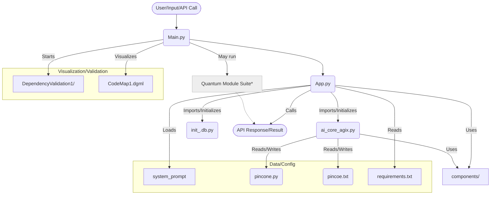

```mermaid
graph TD
    Start([User/Input/API Call])
    Start --> MainPy(Main.py)
    MainPy --> AppPy(App.py)
    AppPy -->|Imports/Initializes| AICore(ai_core_agix.py)
    AppPy -->|Imports/Initializes| DBInit(init_.db.py)
    AppPy -->|Uses| ComponentsDir[components/]
    AppPy -->|Loads| SystemPrompt[system_prompt]
    AICore -->|Reads/Writes| PinconePy(pincone.py)
    AICore -->|Reads/Writes| PincoeTxt(pincoe.txt)
    AICore -->|Uses| ComponentsDir
    MainPy -->|Starts| DependencyValidation[DependencyValidation1/]
    MainPy -->|Visualizes| CodeMap[CodeMap1.dgml]
    AppPy -->|Reads| Requirements[requirements.txt]
    AppPy -->|Calls| Output([API Response/Result])

    subgraph Data/Config
        SystemPrompt
        PinconePy
        PincoeTxt
        Requirements
    end

    subgraph Visualization/Validation
        CodeMap
        DependencyValidation
    end

    MainPy -->|May run| QuantumModules[Quantum Module Suite*]
    QuantumModules -.-> Output

    %% Notes
    classDef faded fill:#eee,stroke:#bbb;
    QuantumModules:::faded
    class QuantumModules faded;
```
*Quantum Module Suite includes: quantum_cosmic_multicore.py, codette_quantum_multicore2.py, codette_meta_3d.py, etc., which are orchestrated as needed.